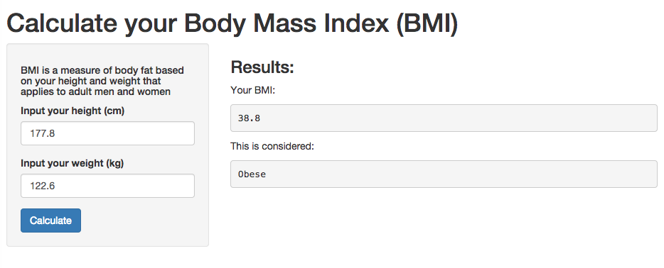

## Introduction

The Body Mass Index (BMI) is a simple index of weight-for-height that is commonly used to classify underweight, overweight and obesity in adults. It is defined as the weight in kilograms divided by the square of the height in metres (kg/m2)

Health Risk Classification According to Body Mass Index (BMI):

* < 18.5 : Underweight
* 18.5 - 24.9 : Optimal weight
* 25 - 29.9 : Overweight
* >= 30 : Obese

---

## How to calculate the Body Masss Index (BMI)

### You can calculate your BMI using this formula:

**BMI = weight(kg)/height(m)2**

Sample R code:

```r
weight <-63
height <-172
bmi <-weight/(height/100)^2
bmi
```

```
## [1] 21.29529
```

---


## Using a Shiny App to calculate your BMI

 

To experience please follow link to deployed app on shinyapp.io:

[https://sfrechette.shinyapps.io/myShinyApp_BMI/](https://sfrechette.shinyapps.io/myShinyApp_BMI/) 


---


## The R code - > server.R

```r
library(shiny)
bmifunc <- function(height, weight){
    bmi <- round((weight/(height/100)^2), digits =1) 
}
bmifunc2 <- function(height, weight){
    bmi <- weight/(height/100)^2
    if(bmi < 18.5) "Underweight"
    else if(bmi >= 18.5 & bmi <= 24.9) "Normal weight"
    else if(bmi >= 25 & bmi <= 29.9) "Overweight"
    else "Obese"
}
shinyServer(
    function(input, output){
        output$bmi <- renderText({bmifunc(input$height, input$weight)})
        output$diagnostic <- renderText({bmifunc2(input$height, input$weight)})
    }
)
```


